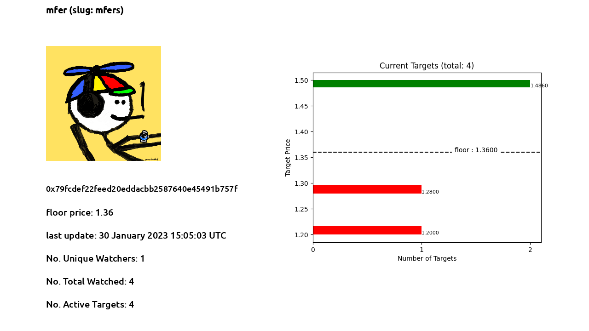

## What does it do?
* Use your discord bot to create NFT Price targets to be notified.
* It also gives a sentiment of the targets set by different users (the more the better) on each collection


* This project uses django for backend integrated with a discord bot. Also viewsets for api is defined.

* Also Join the server I created: https://discord.gg/MJVbDX5mVt

## How to Use

* create virtual env and install the requirements

``` bash
python3 -m venv venv
source venv/bin/activate
pip install -r requirements.txt
```

* Install postgresql for the database

``` bash
sudo apt update
sudo apt install python3-pip python3-dev libpq-dev postgresql postgresql-contrib
```

* Create database and user

  * Log into an interactive Postgres session
  ``` bash
  sudo -u postgres psql
  ```

  * create database named thewatcher
  ``` sql
  CREATE DATABASE thewatcher;
  ```

  * create user and give roles and privileges
  ``` sql
  CREATE USER watcheroot WITH PASSWORD 'toor';
  ALTER ROLE watcheroot SET client_encoding TO 'utf8';
  ALTER ROLE watcheroot SET default_transaction_isolation TO 'read committed';
  ALTER ROLE watcheroot SET timezone TO 'UTC';
  GRANT ALL PRIVILEGES ON DATABASE thewatcher TO watcheroot;
  ```

  * exit
  ``` sql
  \q
  ```


* Discord Bot Variables
Edit this part in "settings.py":

  ```
  # discord settings
  DISCORD_BOT_TOKEN = "your discord bot token id"
  DISCORD_GUILD_ID = <your discord guild id>
  DISCORD_TARGET_CHANNEL_ID = <discord channel id where you want the bot to send alert messages>
  ```
  if you don't know how to create a discord bot, this is a good tutorial: [Discord Bot Tutorial](https://discordpy.readthedocs.io/en/stable/discord.html)

* If you want to use Celery install and run redis
this is a good tutorial: [Redis on Mac & Linux](https://www.codingforentrepreneurs.com/blog/install-redis-mac-and-linux/)

  you can edit celery settings in "settings.py"
  ``` python
  # Celery settings
  CELERY_BROKER_URL = "redis://localhost:6379"
  CELERY_RESULT_BACKEND = "redis://localhost:6379"
  CELERY_RESULT_BACKEND = 'django-db'
  CELERY_CACHE_BACKEND = 'django-cache'
  ```

* The cron job updates collection data every 5 minutes from OpenSea API and updates collection images every 1 minute. You can edit it in "settings.py"

  ``` python
  # cron job
  CRONJOBS = [
      ('*/5 * * * *', 'api.cron.update_collections', '>> /usr/share/nftwatcher/colljob.log'),
      ('*/1 * * * *', 'api.cron.update_collection_image', '>> /usr/share/nftwatcher/colljob2.log'),
  ]

  CRONTAB_LOCK_JOBS = True
  ```

* Run the project
  * Activate the venv
    ``` bash
    source venv/bin/activate
    ```

  * Create migrations

    ``` python
    python manage.py makemigrations
    python manage.py migrate  
    python manage.py migrate --run-sync-db
    ```


  * Add Cron Jobs

    ``` python
    python manage.py crontab add
    ```

  * Run Discord Server

    ``` python
    python manage.py discordbot
    ```

  * (Optional)  You can run development server to access admin panel and api

    ``` python
    python manage.py runserver
    ```

  * You can create service for running discordbot in the background

    ``` bash
    sudo nano /etc/systemd/system/discordbot.service
    ```

    Write this in the file and change the PROJECT_PATH to the project path:
    ``` bash
    [Unit]
    Description=Start DiscordBot

    [Service]
    Type=simple
    ExecStart=PROJECT_PATH/venv/bin/python PROJECT_PATH/manage.py discordbot
    Restart=always

    [Install]
    WantedBy=multi-user.target
    ```

    save the file and run the service start command

    ``` bash
    sudo systemctl start discordbot
    ```

## Discord Commands

* /collection name:slug

  slug: OpenSea Slug for the Collection 

  If the collection exists, it responds with an image of collection info,
  If not you can add the collection using the button and a text input in the modal

  ```
  /collection name:mfers
  ```

* /create_target name:slug target_type:Value/Percentage target:value

  Target Type has two options: Value and Percentage
  if you choose Value, the target value would be the price value you are expecting

  ```
  /create_target name:mfers target_type:Value target:1.5
  ```

  if you choose Percetange the target value would be value% above/below the current floor price (based on positive/negative value)

  +10%
  ```
  /create_target name:mfers target_type:Percentage target:10
  ```

  -10%
  ```
  /create_target name:mfers target_type:Percentage target:-10
  ```


## Further Notes
I would appreciate it you could give feedback and follow me on twiterr. Also I'd appreciate any more contributions and suggestions for improvment.